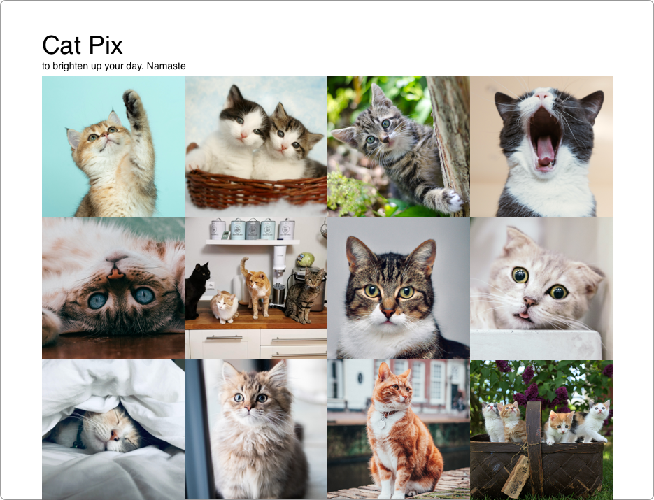

# The Problem
Cats are cute, and many people love them. The world, especially now, could use more positivity, so we want to create a smooth, endless feed of adorable cat pictures.

I believe that a polished version of this app can get 10,000+ users, because I built a pretty [low-effort, v1 version](https://play.google.com/store/apps/details?id=com.randomappsinc.catpix) and it got around 1,000 users.

# MVP Requirements
- User opens the app and it shows an endless feed of cat pictures
- User doesn't see the same photos compared to previous opens

To help with visualization, here are some sample mocks you can work off of:

# Best Platform
**Mobile, but web is okay**

Easy media consumption is synonymous with mobile, but there's no reason you can't do this on web.

# Difficulty
**Easy**

The v1 of this project is extremely simple as it's effectively a nice UI/UX wrapper around a single focused API call.

For my version of the app, I used the [Cat API](https://thecatapi.com/), which allows 10,000 free API calls per month, more than enough to support a few thousand users. The big problem with this API though is that there's a lot duplicates, often times right next to each other. If you're going to use this API, I recommend creating your own API (turning this into a back-end project too!) that wraps it and filters out the duplicates (doing this on the client seems expensive).

Another option is to pull content from the Cat API, filtering for dupes, and putting them into your own database. And once you have 500+ unique photos, you can create your own API for this data source.

# Possible Extensions
- Being able to set any picture as your wallpaper
- Image editor into saving
- Bookmarking/favoriting
- Filters
- User accounts to save filter settings, do feed personalization, and persist favorites
- Ability to download images
- Share button to social media
