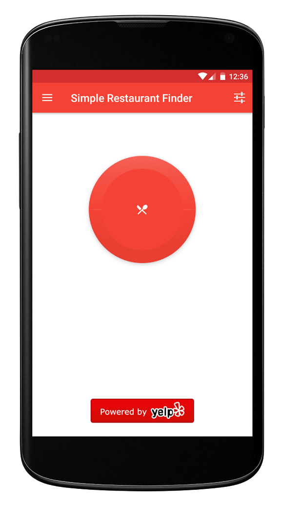

# The Problem
I want to be able to figure out where to eat, quickly. It's true that there's a lot of apps that help you find restaurants, but most of them place the burden of choice on you, providing a search bar and an arsenal of filter options. I want to flip that dynamic, having the app choose a high-quality, open restaurant for me. A concrete use-case I've had is choosing a place to eat within my friend group. All of us are nice and don't like to force decisions on others, but this just leads to indecision. Delegating the decision to a quick app solves this.

I know that this is easily a 10k+ users app, because I built a [very basic version of this app](https://github.com/Gear61/Food-Button) myself on Android and it's gotten 6,000+ users. Downloads have been pretty stagnant for a while now, because I haven't invested in it for years. It is also using the Yelp API, which is very US-centric. If someone were to make a modern version of this app using a better API, I'm sure it could get 10k or even 100k users.

# MVP Requirements
- The app opens up to a big button, which the user can tap
- Tapping the button picks a high quality, nearby, and open restaurant. You can define these terms yourself, but if you want to know what I think:
  - High quality: At least 4/5 in whatever rating system your API uses
  - Nearby: Within 5 miles and/or a 15 minute drive
  - Open: Restaurant won't close for 1 hour+
- You can tap a navigate button to immediately start heading to the restaurant

To help you envision the UI, here's the home screen of my Android version:

# Best Platform
**Mobile, but web is also solid**

Mobile is the best for this as this is a more "on-the-go" type thing, and it has the best "hero flow" where you can just tap a navigate button and start heading there in Google Maps. However, if you have access to your computer (e.g. you are hosting an event), you can do this on your computer as well. Restaurant APIs provide a lot of information so the extra space that web gives you is useful.

If you're going to build this on Android, feel free to fork/copy my code. It is open source for a reason. 😃

# Difficulty
**Easy**

Getting a base version of this is extremely easy, especially if you use the very open and straightforward Yelp API. It's just a GET, and from there, it's primarily a UI problem instead of a gnarly technical problem.

# Possible Extensions
- Use a better API. In particular, Google Places is probably the best, but I'm unsure how much you can do for free
- Do API aggregation or routing. So instead of just using 1, use Yelp, TripAdvisor, Google, etc to really get the best results. If you are aggregating though, you will need to de-dupe. Routing means that you detect which region the user is in and use the best API accordingly
- Build your own API that wraps the restaurant APIs, either doing the routing/aggregation logic
- Use machine learning or some basic logic to learn the tastes of the user over time, refining your choice algorithm
- Customizable filters, so the user can refine their tastes manually
- Automatic push notifications suggesting places the user might like
- Bookmarks/favorites
- Call restaurant button
- Order button which hooks into DoorDash, Uber Eats, whatever ordering/delivering platform is available for it
- Copy/share restaurant details
