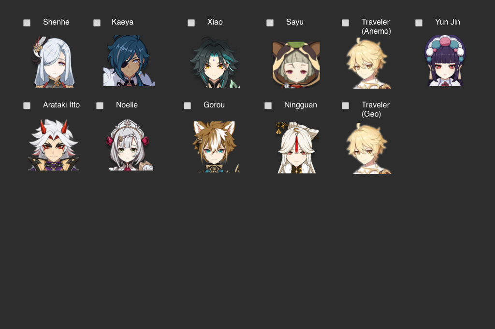
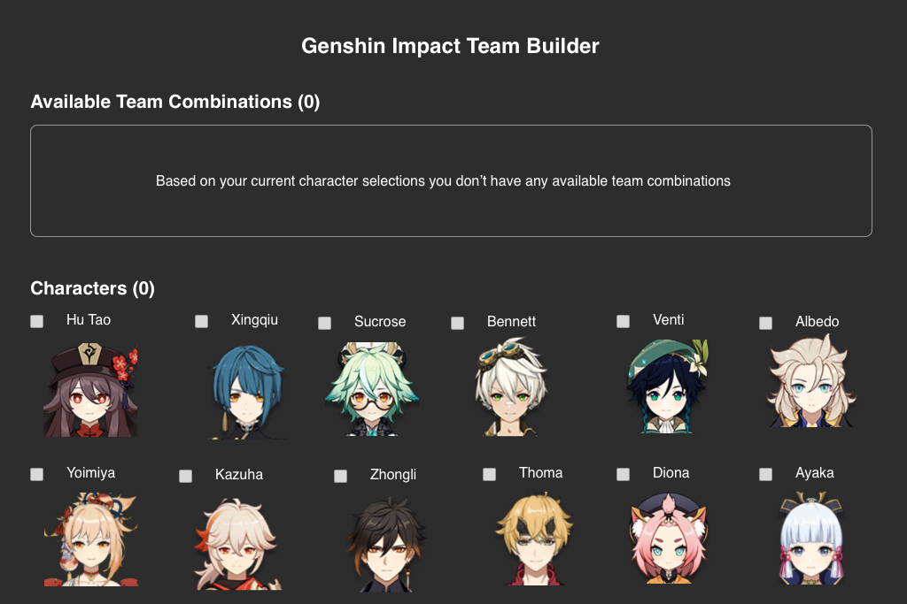
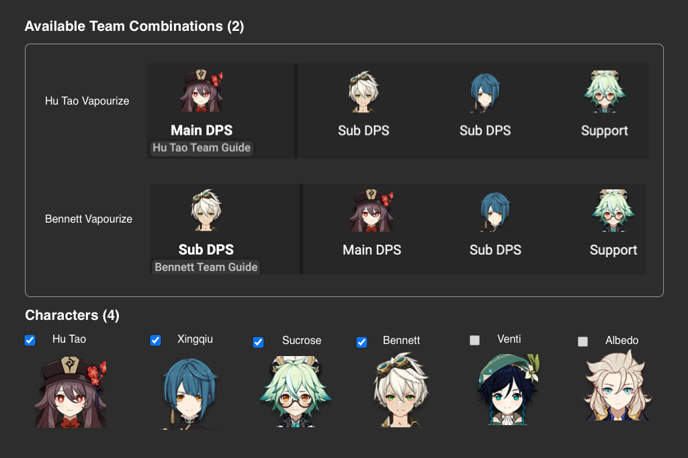
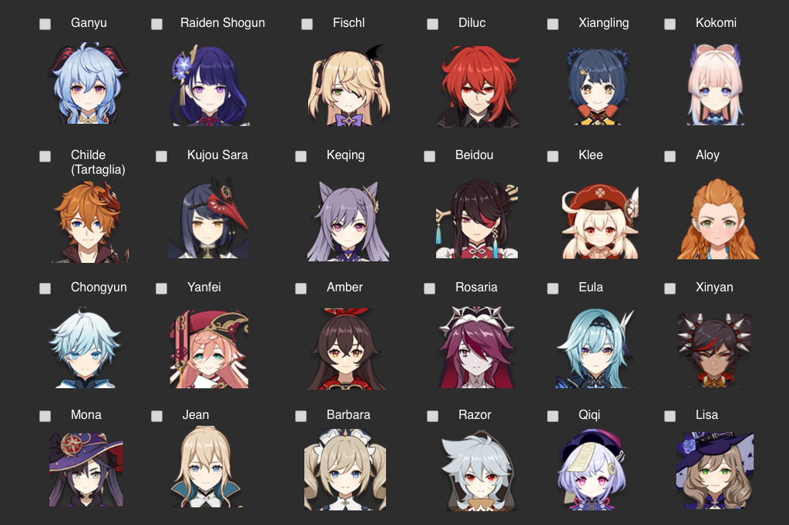

# The Problem
I play a lot of Genshin Impact, which is an extremely popular video game. One of the core aspects of the game is taking your many characters and figuring out how to make effective teams with them.

Right now, there is no low-effort tool to help you do this. The process is currently very manual. You either need to watch a bunch of YouTube videos or go to a website like [this one](https://www.genshinlab.com/team/), where they just list out every possible team and you need to go through the cognitive load of checking whether you can buid each one.

**I want to build a tool where I can input what I have in-game (characters, constellations, and weapons) and get suggested teams automatically.**

# MVP Requirements
- User can input the characters they have
- The homepage is a list of suggested teams that are possible for the player
- If the user clicks on a suggested team, it explains how the team works and has guides on how to play it

To help with visualization, here are some sample mocks you can work off of:

# Best Platform
**Web, but mobile isn't too bad**

This is a content display app, so the extra space on web is nice. However, Genshin Impact is also playable on mobile and has a large userbase there; this means that a mobile app for this makes sense as well.

# Difficulty
**Medium**

There's a lot of manual work here as you need to source the team database and guiding content for each one. The algorithm to match character pool to teams is also interesting. After that, it's a UI/UX problem.

# Possible Extensions
- Accounts so people can access the tool anywhere
- Be able to add character constellations
- Be able to add what weapons you have
- Allow users to mark which teams they're using
- Bookmarking/favoriting
- Data and analytics to show things like most popular teams
