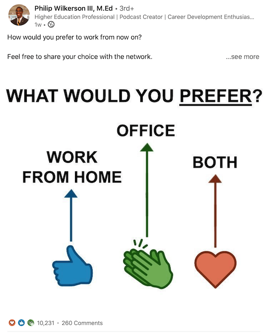
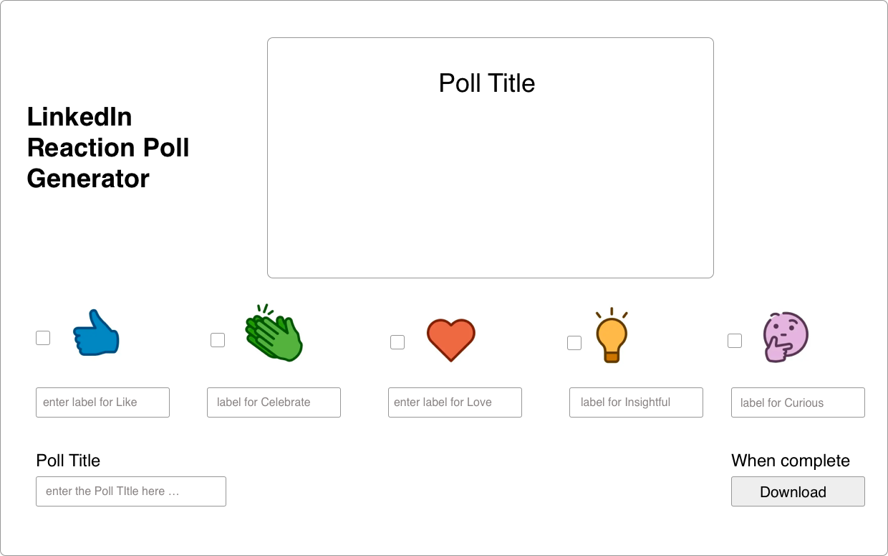
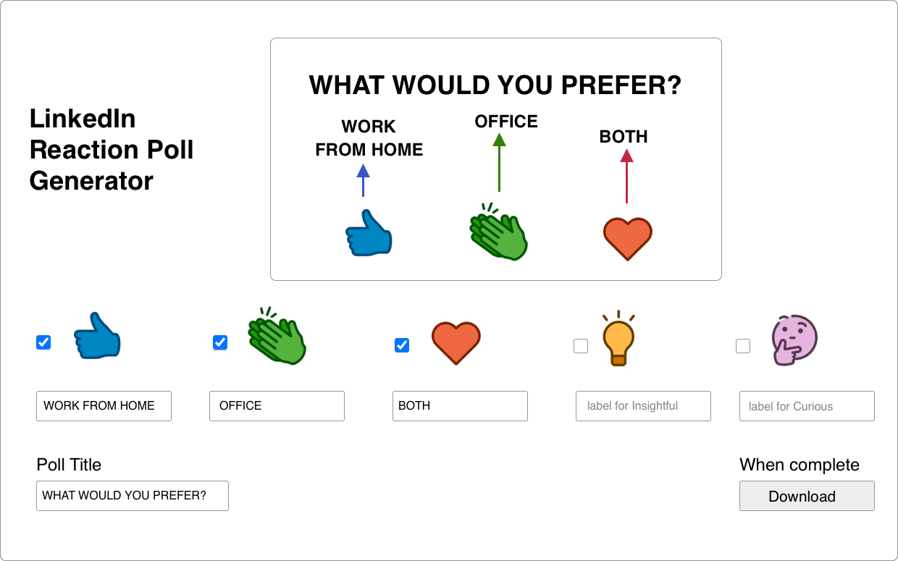

# The Problem
Reactions increase the reach of a post on LinkedIn similar to what happens on every other social media platform. Because of this, something I call "reaction polls" have become really popular as a growth hack. Instead of running a regular LinkedIn poll, which is frankly pretty jank and constrained to 4 options, you can have users react to your post to vote on the option they want, creating a much richer experience that also nets you the poster a bunch of free engagement. If you don't know what I'm talking about, here's an example of one of these reaction polls:

Right now, there's no tool to make the generation of these reaction polls easy. You have to do a bit of image editing yourself, which is cumbersome for many users as they're barely fluent in MS paint like myself. We want to fill in this gap.

# MVP Requirements
- Show an initially blank image with the 5 LinkedIn reactions. This will be the "canvas" that lets users know what their reaction poll currently looks like.
- User can type in what question they want to poll to ask. The "canvas" should update in real-time.
- User can type in the text they want to show up for each of the reactions. The "canvas" should update in real-time.
- User can click a button and download the filled in template image when they are done.

# Designs
If you're having trouble envisioning the experience, here are some basic mocks you can work off of.

# Best Platform
**Web**

This UI will require a lot of space, so web is by far the best platform to host this. You can build mobile, but I don't recommend it.

# Difficulty
**Medium**

I am unsure how the image generation works. You may have to store it on a temporary cloud or something, which will add a substantial amount of difficulty to the project. So I'm putting this at Medium for now; it could definitely be easy, especially the MVP.

# Possible Extensions
- Allow users to customize which of the 5 reactions they want
- Different template images with varying backgrounds
- Text customization (size, font, color)
- Hosting the user's created images and forming a marketplace out of them!
