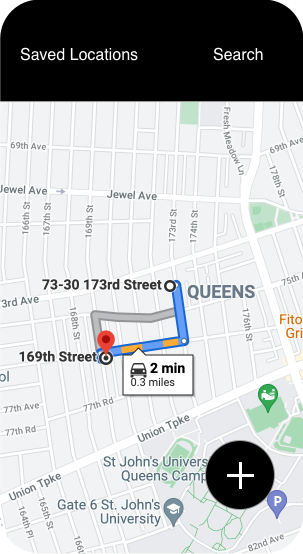

# The Problem
I want to be able to figure save where I am as a location of interest, so I can quickly access it later. It's inspired by a use-case I had in Taiwan (I'm Taiwanese, so I'll regularly go back to visit my family). Anyways, I walked out of our Airbnb and realized I didn't have the address saved. I didn't book the Airbnb or have the Airbnb app, so it was hard to find, and using Google Maps isn't great as saving your current location is a hard to find feature that takes several clicks (Google Maps's UI is also very crowded in general). I eventually figured out how to do this in Google Maps, but even after saving the location, saved locations are not a first class citizen in Google Maps, so it's hard returning to them.

I'm fairly confident that this is 10k+ users app, because I built a [very basic version of this app](https://github.com/Gear61/Location-Manager) myself on Android and it's gotten ~500 users with good reviews despite looking terrible. I literally just made a v1 and never touched it again.

# MVP Requirements
- User can tap a button to instantly grab their current location as lat/long and save it.
- User can see a list of their saved locations.
- User can tap any saved location to immediately start navigating torwards it.

To help with visualization, here are some sample mocks you can work off of:

# Best Platform
**Mobile**

Location is very much a mobile thing as it's "on-the-go", so this really isn't feasible on web.

# Difficulty
**Easy**

Getting a base version of this is extremely easy as fetching the user's current location should have a million tutorials across iOS and Android. I have a bullet-proof location fetching flow that is built from scratch and doesn't use 3rd party libraries, which you can find [here](https://github.com/Gear61/Instafood).

# Possible Extensions
- Open up some sort of MapView that the user can move around as the location picker, and it is defaulted to what the location services think is the user's current location so the user can just hit enter if they want.
- Create a widget that the user can have on their phone homescreen to make the location saving flow truly 1 tap (don't even need to open the app!)
- Make locations shareable
- Be able to add titles and descriptions to locations
- Bookmarking/favoriting
- Folders to categorize locations
- Data and analytics so users can see their most visited locations

# Thanks
The mocks in this spec were provided by the amazing [Luke Hovee](https://www.linkedin.com/in/luke-hovee-2433b7b4/)! He's working on a website that makes it easier for junior developers in particular to pick up and manage projects, which you can find [here](https://www.projects-for-devs.com/#/).
