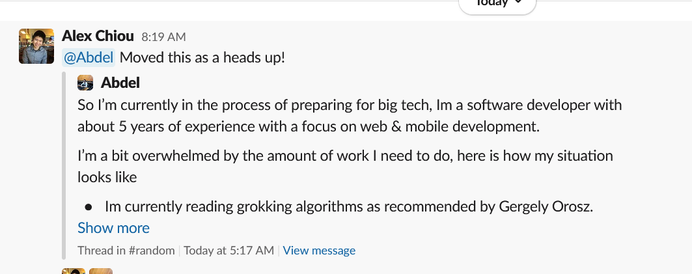

# The Problem
The Tech Career Growth community has 6,600+ members as of 11/7/2021, and it's constantly growing. That's a lot of people and a lot of posts; what's important is that a lot of folks haven't used Slack before and aren't aware of how to find channels besides the default ones (finding a channel is not very intuitive in the Slack UI). Because of this, a lot of folks post in the incorrect channels, almost always because they are unaware that a better channel exists. When this happens, I do a hacky post move like so:

1. I share the post into the proper channel. I @mention the poster to let them know I moved it.
2. I delete the original post.
3. I invite the poster to the proper channel if necessary, which it often is.

Here's an example of a moved post:

In a nutshell, I want a Slack bot that automatically does these now manual steps. I looked around the Slack apps marketplace and wasn't able to find anything, even paid apps. It's crazy to me that this doesn't exist; we had this at Facebook to move Workplace posts around easily. Given that Slack is enterprise-facing, I can definitely see this starting out as a free app, getting a dedicated userbase, and then being monetized in a freemium way to make a significant amount of $$$.

# MVP Requirements
- A Workspace Admin/Owner sees a post they want to move to [target_channel]. They reply to the post with @MoveBot #target_channel.
- The MoveBot moves the post to the target channel, deleting any remnants of the old version of the post in the incorrect channel.
- The MoveBot lets the poster know that their post has been moved.
- There are a couple ways to do the move:
  - [Best] The post is perfectly moved over, with the original poster's name and profile picture being attached to it and everything. It is indistinguishable from the original post. In this case, the MoveBot could reply to the moved post with something like: "@user_name, your post has been moved to a better channel! Thanks for participating in Tech Career Growth community!"
  - [Okay] The bot duplicates the post and posts it within the other channel under its user handle, making the post belong to MoveBot. It would prefix the post with the "@user_name, your post has been..." message and then have the original post contents after 2 newlines.
  - [Worst] Share the message into other channel like what we're doing now. We want to avoid this as the nesting is kind of ugly, and the original user feels sort of disconnected from their own post.

# Best Platform
**Slack**

This is specifically for Slack, so... yeah.

# Difficulty
**Easy**

I'm not sure how easy/possible it is to do a true move, but I can't imagine the "hacky" move being that hard. I imagine most folks in the community (myself included) are not familiar with Slack bot development; luckily, Colin Cazabet from within our community is great at this. He built a nice reply bot in the resume channel and wrote an awesome Medium article about it [here](https://medium.com/analytics-vidhya/create-and-distribute-a-slack-bot-with-python-and-aws-in-1-hour-41c4a6c0f99d).

# Possible Extensions
- Get the move closer to a "true move" if that turns out to be difficult
- Automatically add the user to the channel their message has been moved to
- Make the bot behavior customizable. In particular, allow the move message to be customizable by the Slack space owner.
- Move all replies to the original post as well, ideally keeping them in a thread against the moved post. If creating a thread against the moved post is difficult, you can just move them into the target channel as well
- Some sort of data tracking and analytics presentation, so users of the bot can see what's the most moved to channel and data like that
