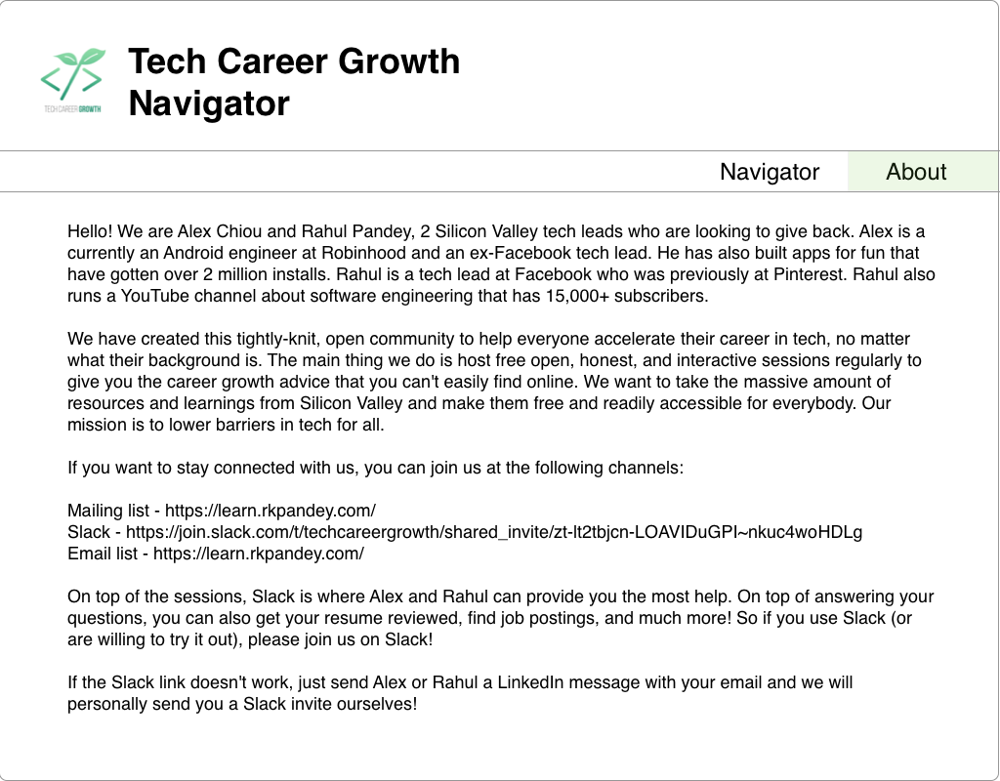
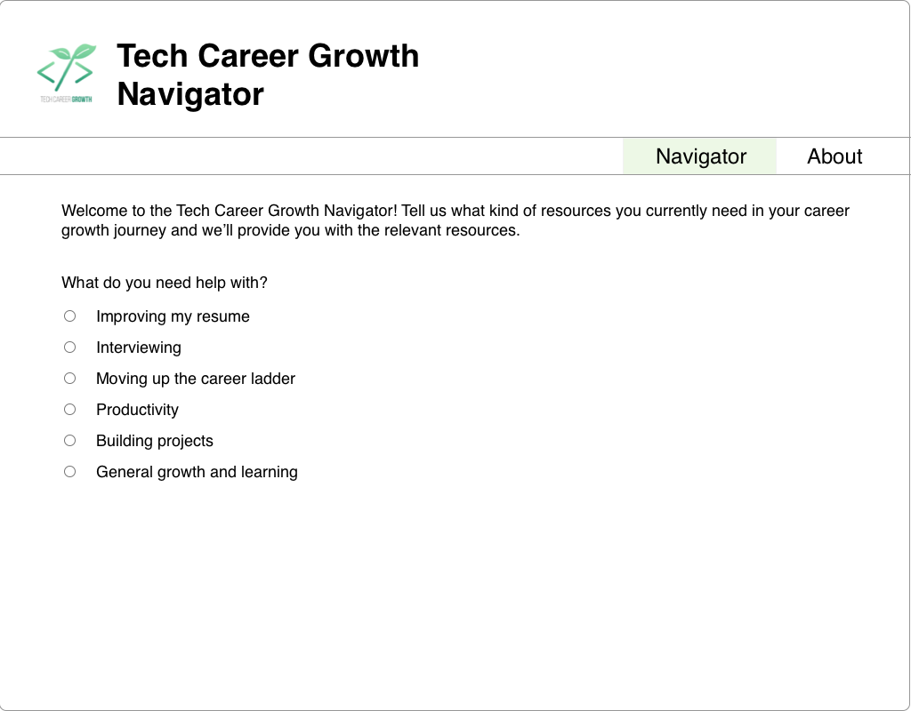
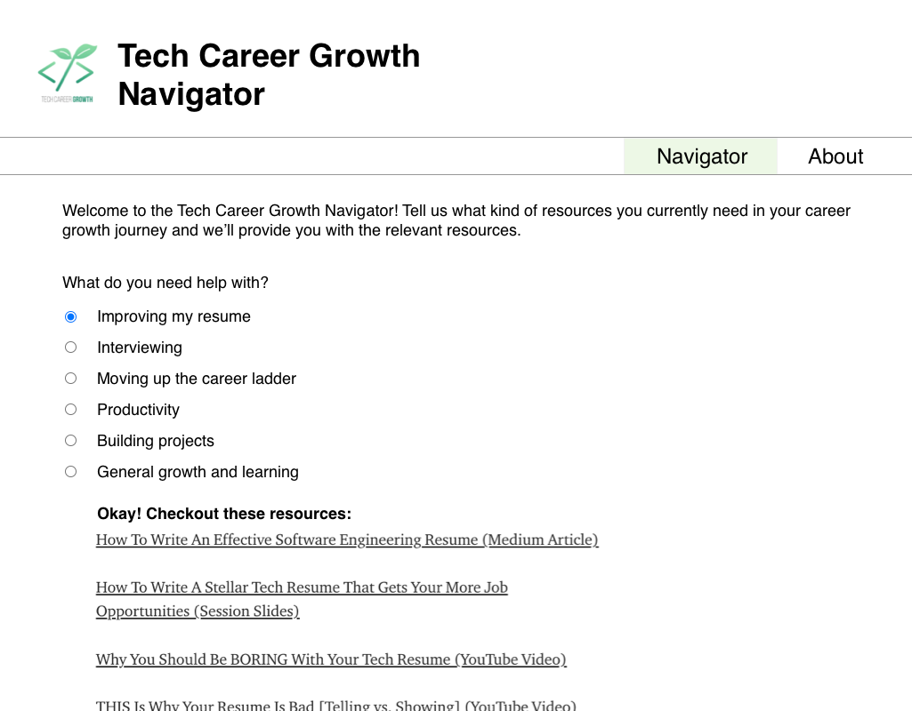
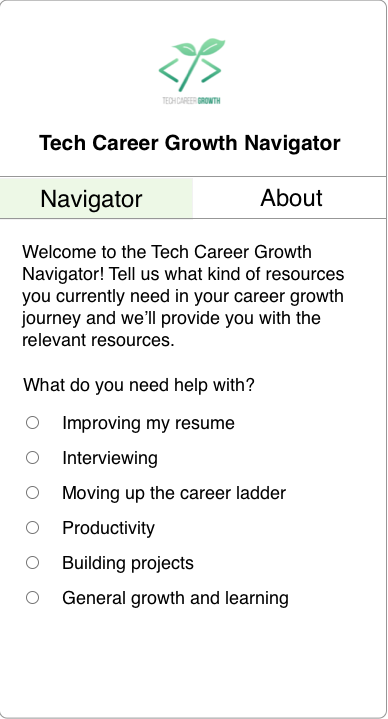

# The Problem
As of 11/8/2021, the Tech Career Growth community has ~9,000 members and Rahul and I have created a ton of resources. In a nutshell, it's hard to keep track of all this. What we'll see happen often is new members will join and then ask questions that are answered by old content we have already made. It's hard to discover the old content, so the new member doesn't know it exists. To make things worse, even Rahul and I don't have links handy for our own old resources.

In a nutshell, we want a create a low-effort navigator for official Tech Career Growth Community resources. Instead of the user having to actively seek them out, the burden is placed on the app. The user tells the app what they need, and the app returns the relevant resources.

Right now, this job is being served by this [extremely janky and manual Medium article](https://chioualexander.medium.com/the-ultimate-guide-to-advance-your-career-in-tech-regularly-updated-7b2929355f31?sk=bb9fb981ecaee453f31119aac636290b). It's literally just a resource that links to other resources. 😆

# MVP Requirements
- User can answer a series of questions about where they are with their tech career
- The app suggests Tech Career Growth resources (i.e. things made by Rahul and Alex) accordingly

Proposed question tree:
- What do you need help with? (single choice)
  - Improving my resume
  - Interviewing
  - Moving up the career ladder
  - Productivity
  - Building projects
  - General growth and learning

- Improving my resume
  - Link resume resources

- Interviewing -> What part of the interview are you struggling with?
  - Data structures and algorithms
  - Behavioral
  - System design
  - Nerves and anxiety
  - Studying in general

- Moving up the career ladder
  - Link promotion resources

- Productivity
  - Link productivity resources

- Building projects
  - Link side project resources

- General growth and learning
  - Link non-promo growth resources

For resources, just use the janky Medium article linked above.

To help with visualization, here are some sample mocks you can work off of:

# Best Platform
**Web, but mobile works too**

I just really like web for content displays, so I prefer that. Anyways, all surfaces are fine; this isn't a super complex app.

# Difficulty
**Easy**

There's really no complex patterns here; this product is just a UI app. Most of the work will be manually setting up the resource tree.

# Possible Extensions
- "Outside" flows, i.e. having options like "My need isn't covered" or something
- Ability to submit a request for a resource. It can go to an email in v1. Ideally, it integrates with some Slack bot
- Some sort of admin panel so Rahul and I can add resources to the site map

# Thanks
The mocks in this spec were provided by the amazing [Luke Hovee](https://www.linkedin.com/in/luke-hovee-2433b7b4/)! He's working on a website that makes it easier for junior developers in particular to pick up and manage projects, which you can find [here](https://www.projects-for-devs.com/#/).

